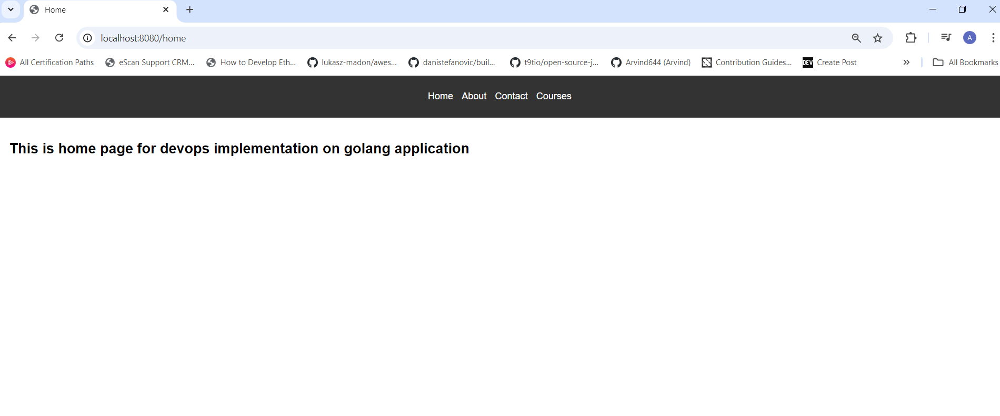

# Golang Devops Project

This is a end to end devops implementation of a simple website written in Golang. It uses the `net/http` package to serve HTTP requests.

## Running the server

To run the server, execute the following command:

```bash
go run main.go
```

The server will start on port 8080. You can access it by navigating to `http://localhost:8080/courses` in your web browser.

## Looks like this



## Features

- Containerization (Multi Stage Docker Build)
- Creating Kubernetes Manifests
- Continuous Integration using GitHub Actions
- Continuous Delivery using Argo CD
- Kubernetes Cluster creation and setup
- Helm chart creation and configuration for multiple environments
- Ingress controller creation, configuration to expose application
- DNS mapping for our domain
- End to End CI/CD pipeline
